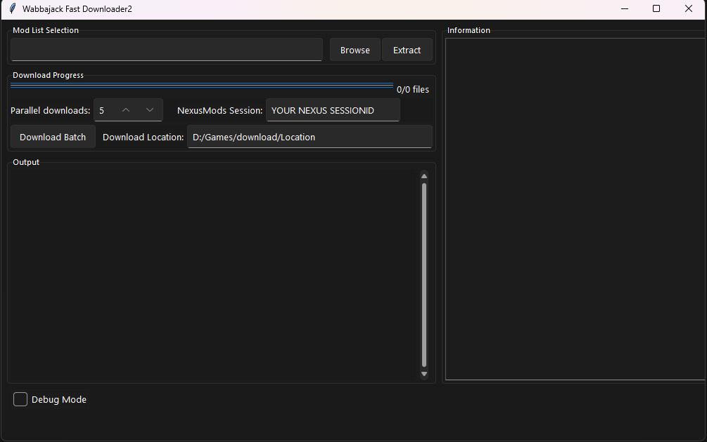

# Wabbajack Fast Downloader 2

---

### 🚨 IMPORTANT WARNING 🚨

**Using this tool is a violation of Nexus Mods policy.** Automated downloading outside their official API or website methods can lead to restrictions or bans on your Nexus Mods account. The creator of this tool takes **no responsibility** for any consequences resulting from its use. **Proceed at your own risk.**

# Please Support Nexus
---

### Installation

```bash
git clone https://github.com/amssss0/Wabbajack-fast-downloader2.git
cd ./Wabbajack-fast-downloader2
pip install -r requirements.txt
python gui.py
```

---


### How to Use (Updated Process)

1.  **Extract Mod List:**
    *   First, use the `"Extract"` button within the tool to process your Wabbajack mod list file (`.wabbajack`). This will create a output.csv listing all the mods. You only need to do this once.

2.  **Enter Session ID:**
    *   You need to provide your `nexusmods_session` value in the `"YOUR NEXUS SESSIONID"` field.
    *   **Watch the Video:** Detailed instructions on how to find this value are in the video located in the `docs` folder provided with the tool.
    *   **One-Time Setup (Usually):** You typically only need to do this once. However, you **must** re-enter it if you log out of Nexus Mods, or if you log into your Nexus Mods account on a different device or browser.

3.  **🔒 NEVER Share Your Session ID:**
    *   Your `nexusmods_session` value is sensitive authentication data. Keep it private and secure. Sharing it compromises your Nexus Mods account.

4.  **Set Download Location:**
    *   Specify the folder where you want the mods to be downloaded.

5.  **Start Download:**
    *   Click the `"Download Batch"` button to begin.

---

### Key Updates & Features

*   **Download Resuming:** Close the program and restart it later; downloads will pick up where they left off.
*   **Hash Checking:** Verifies downloaded files are complete and not corrupted.
*   **No Duplicate Downloads:** The tool intelligently skips files you already have.
*   **Browserless Operation:** Downloads occur directly without needing a separate browser window open.
*   Includes various other improvements for stability and efficiency.

---

**Reminder:** For help finding your `nexusmods_session` value, please refer to the instructional video in the `docs` folder.


**Wabbajack Fast Downloader** is a tool designed to streamline the process of downloading mods for modlists generated by Wabbajack. It extracts mod IDs and file IDs from the Wabbajack modlist JSON file, generates download links, and opens these links in batches for efficient downloading.

> **Project Origin:** This project was inspired by the need for a faster mod downloading process for Wabbajack-generated modlists, originating from [this GitHub issue](https://github.com/parsiad/nexus-autodl/issues/17).


## Requirements

- [Python 3.x](https://www.python.org)

## Executable Usage | GUI Usage



## Acknowledgments

This project was inspired by the need for a faster mod downloading process for Wabbajack-generated modlists.

## Disclaimer

This tool is intended for personal use and should be used responsibly. Respect the terms and conditions of the mod authors and Nexus Mods. Use this tool at your own risk.

## ✨ Contributors

<table>
  <tbody>
    <tr>
      <td align="center" valign="top" width="14.28%">
        <a href="https://github.com/M1n-74316D65">
          
          <br />
          <sub><b>M1n-74316D65</b></sub>
        </a>
        <br />
        <a href="https://github.com/M1n-74316D65/Wabbajack-fast-downloader/commits?author=M1n-74316D65" title="Code">💻</a>
        <a href="https://github.com/M1n-74316D65/Wabbajack-fast-downloader/commits?author=M1n-74316D65" title="Documentation">📖</a>
      </td>
      <td align="center" valign="top" width="14.28%">
        <a href="https://github.com/DassaultMirage2K">
          
          <br />
          <sub><b>DassaultMirage2K</b></sub>
        </a>
        <br />
        <a href="https://github.com/M1n-74316D65/Wabbajack-fast-downloader/commits?author=DassaultMirage2K" title="Code">💻</a>
        <a href="https://github.com/M1n-74316D65/Wabbajack-fast-downloader/commits?author=DassaultMirage2K" title="Documentation">📖</a>
      </td>
    </tr>
  </tbody>
</table>

<!-- ALL-CONTRIBUTORS-LIST:START - Do not remove or modify this section -->
<!-- prettier-ignore-start -->
<!-- markdownlint-disable -->
<!-- markdownlint-enable -->
<!-- prettier-ignore-end -->
<!-- ALL-CONTRIBUTORS-LIST:END -->

*This project follows the [all-contributors](https://allcontributors.org) specification*
